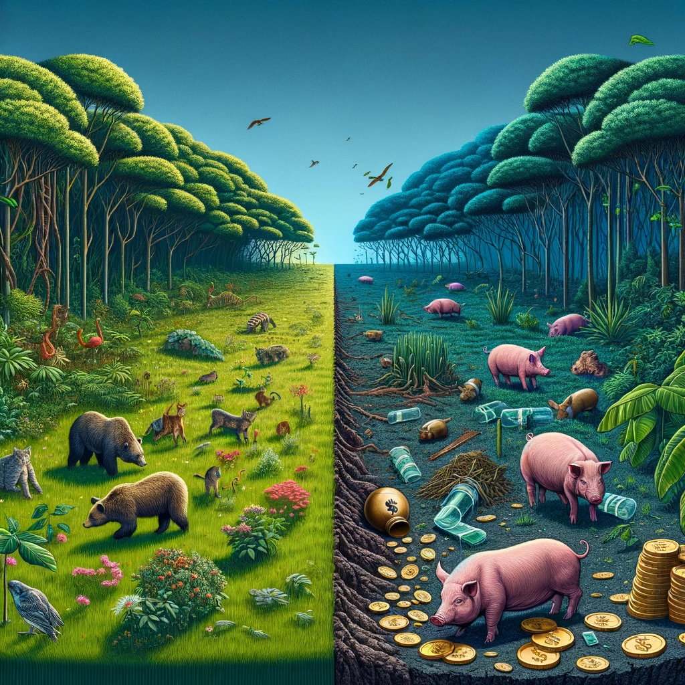

# The wild cost of invasive feral animals worldwide
### Leader: <a href="https://www.researchgate.net/profile/Ismael-Soto-4">Ismael Soto</a>
### University of South Bohemia Ceske Budejovice

<strong>Authors</strong>:
Ismael Soto, Paride Balzani, Francisco J. Oficialdegui, Carlos Molinero, Antonín Kouba, Danish A. Ahmed, Anna J. Turbelin, Emma J. Hudgins, Thomas W. Bodey, Showkat Ahmad Gojery, Franck Courchamp, Ross N. Cuthbert, Phillip J. Haubrock

## Abstract
Invasive non-native species are a growing burden to economies worldwide. While domesticated animals (i.e., livestock, beasts of burden or pets) have enabled our ways of life and provide sustenance for countless individuals, they may cause substantial impacts when they escape or are released (i.e., become feral) and then become invasive with impacts. We used the InvaCost to evaluate monetary impacts from species in the Domestic Animal Diversity Information System database. We found a total cost of $141.95 billion from only 18 invasive feral species. Invasive feral livestock incurred the highest costs at $90.03 billion, with pets contributing $50.93 billion and beasts of burden having much lower costs at $0.98 billion. Agriculture was the most affected sector at $80.79 billion, followed by the Environment ($43.44 billion), and Authorities-Stakeholders sectors ($5.52 billion). Damage costs comprised the majority ($124.94 billion), with management and mixed damage-management costs making up the rest ($9.62 and $7.38 billion, respectively). These economic impacts were observed globally, where Oceania, North America and Europe were the most impacted regions. Islands recorded a higher economic burden than continental areas, with livestock species dominating costs more on islands than mainlands compared to other feral species. The costs of invasive feral animals were on average twice higher than those of wild species. The management of invasive feral populations requires higher investment, updated regulations, and comprehensive risk assessments. These are especially complex when considering the potential conflicts arising from interventions with species that have close ties to humans. Effective messaging to raise public awareness of the impacts of feral populations and appropriate legislation to prevent or control such invasive feral populations will substantially contribute to minimizing their socioeconomic and environmental impacts.

**Keywords**: biological invasions; agriculture; non-native species; economic impacts; conservation; InvaCost

 

## <a href="https://github.com/IsmaSA/Aquaculture/tree/master/Code">Script:</a>
Code created by: <a href="https://www.researchgate.net/profile/Ismael-Soto-4">Ismael Soto</a>   

[][mail] 

[mail]: mailto:isma-sa@hotmail.com

                                                                                   
 

# Domestic-InvaCost-topic
Cleaning matching data
 - DAD-IS.csv: refers to DAD-IS FAO database (domestic species)
 - Extract_names.xlsx: refers to scientific names of domestic and wild species from: https://en.wikipedia.org/wiki/List_of_domesticated_animals
 - Help file: Some specific species e.g. Vicuña is not find as Domestic species, so I fill these gaps consulting this help file
 - Cleaning_data: Reproducible code to the filtering steps
 - 02_Domestic_analyses: Reproducible code to main analyses
 - Domestic.R refers to "overall" code used for the figures and analyses
